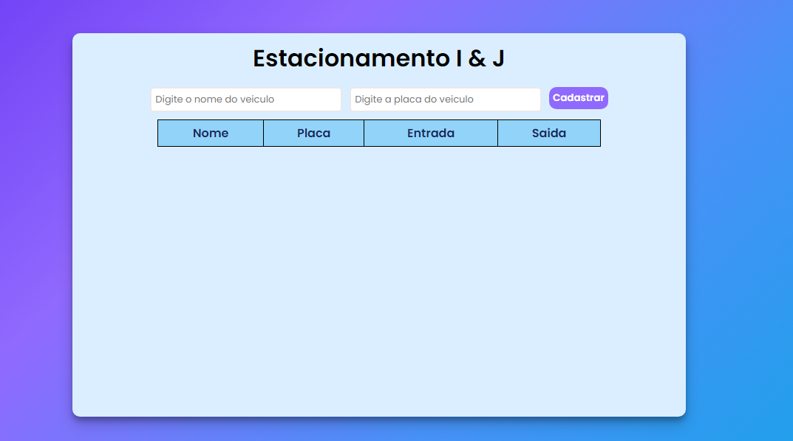

# Sistema de Estacionamento

Projeto criado para a conclusão do curso de   <ins>Introdução ao TypeScript: Explorando Classes, Tipos e Interfaces</ins> da **Digital Innovation One**.

## Sobre:

 

- Um Sistema de estacionamento onde se insere o nome e a placa de um veiculo e mostra o seu momento de entrada em uma tabela, e ao retirar um veiculo e mostrado quanto tempo o veiculo ficou no estacionamento

- Todos os dados da tabela são salvos no *localStorage* do browser.

### Tecnologias utilizadas no projeto:

- Marcação HTML5 semântica
- Propriedades personalizadas de CSS
- Flexbox
- TypeScript

### Links:

👉 [Clique aqui para acessar o Sistema de Estacionamento](https://israeljorge.github.io/estacionamento/)

